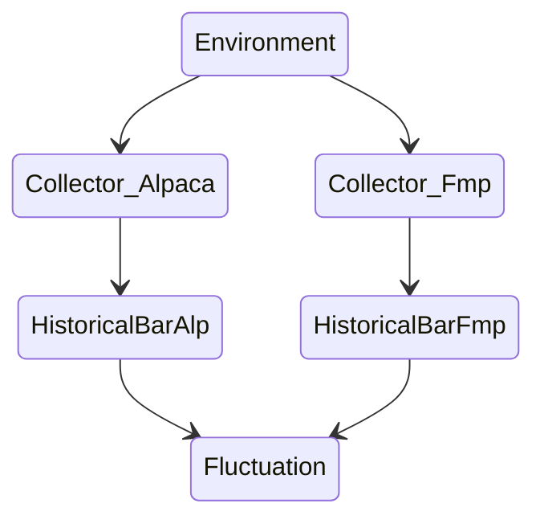

# Data
Raw **data** collected by collector.
## HistoricalBarAlp
### Scheme
## HistoricalBarFmp
### Scheme

# ProcessedData
The *data* is processed for analysis and become **processed_data**.
## Fluctuation
Record summarizing the rate of change for n days.

### Scheme
| name  | type     | describe                                                                                                   |
|-------|----------|------------------------------------------------------------------------------------------------------------|
| ts    | datetime | Timestamp of now.                                                                                          |
| o0    | R        | Percentage change open price "now" basis point from the previous day.                                      |
| o1    | R        | Percentage change open price in basis points between "1" day before and the day before.                    |
| ...   | ...      | ...                                                                                                        |
| o{n}  | R        | Percentage change open price in basis points between "n" day before and the day before.                    |
| h0    | R        | The current opening price and the rate of return in basis points of the high price.                        |
| h1    | R        | Percentage of return in basis points of the previous day's opening price and the high price.               |
| ...   | ...      | ...                                                                                                        |
| h{n}  | R        | The percentage return in basis points of the opening price and the high price of the previous "n" days.    |
| l0    | R        | The current opening price and the rate of return in basis points of the low price.                         |
| l1    | R        | Percentage of return in basis points of the previous day's opening price and the low price.                |
| ...   | ...      | ...                                                                                                        |
| l{n}  | R        | The percentage return in basis points of the opening price and the low price of the previous "n" days.     |
| c0    | R        | The current opening price and the rate of return in basis points of the closing price.                     |
| c1    | R        | Percentage of return in basis points of the previous day's closing price and the low price.                |
| ...   | ...      | ...                                                                                                        |
| c{n}  | R        | The percentage return in basis points of the opening price and the closing price of the previous "n" days. |
| v0    | R        | Percentage change volume "now" basis point from the previous day.                                          |
| v1    | R        | Percentage change volume between "1" day before and the day before.                                        |
| ...   | ...      | ...                                                                                                        |
| v{n}  | R        | Percentage volume between "n" day before and the day before.                                               |
| avg_s | R        | Average of closing prices over a {short} period of time.                                                   |
| avg_m | R        | Average of closing prices over a {middle} period of time.                                                  |
| avg_l | R        | Average of closing prices over a {long} period of time.                                                    |
| avg_v | R        | The average of volume over a {long} period of time.                                                        |

### Variables
variable | value | description
-- | -- | --
n | 10 | It goes back to "n" days ago.
short | 6 | "short"-term range in average calculation.
middle | 36 | "middle"-term range in average calculation.
long | 216 | "long"-term range in average calculation.

# Information
The result of analyzing the *processed_data* is **information**.

## MachineLearningSourceData
### Scheme
| Name             | Type          | Description                                                          |
|------------------|---------------|----------------------------------------------------------------------|
| source           | str (PK)      | Analyze source                                                       |
| scope_start      | datetime (PK) | Scope of start of analyze.                                           |
| scope_end        | datetime (PK) | Scope of end of analyze.                                             |
| column_x         | list (PK)     | Column name used for input. (ex. [col_a, col_b, ...])                |
| column_y         | list (PK)     | Column name used for output. (ex. [col_a, col_b, ...])               |
| train_test_ratio | N (PK)        | Ratio of train to test in source data. (For example, "70" means 0.7) |
| source_data_id   | str(UNI)      | ID of source data. This is hash value of PK.                         |
| timestamp        | datetime      | Time the analysis results were registered.                           |
| ...              | ...           | ...                                                                  |

## MachineLearningAlgorithms
### Scheme
| Name      | Type     | Description        |
|-----------|----------|--------------------|
| name      | str (PK) | Name of Algorithm. |
| timestamp | datetime | Registration Date. |

# Intelligence
**Intelligence** is generated from *information*.

It will guide future actions.

# DataFlow

